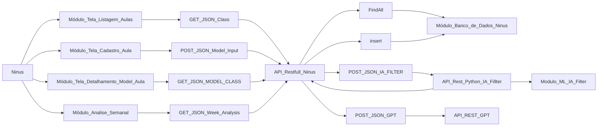

# Projeto Ninus 🐼📕
_A Ninus é uma solução oficial da **Smash Code!**_
> Smash Code! 

# Uma breve descrição 💬
_Nosso aplicativo se chama ninus e ele é para professores do ensino
infantil que desejam reduzir significamente o tempo de montagem de aula.
O foco do professor deve ser no ensinamento, e muitos professores do
Ensino infantil gastam entre 2 e 3 horas para montar uma aula, por
Justamente ser complexo e detalhado. Toda a montagem de aula deve
Seguir um padrão rígido da bncc (base nacional comum curricular), e isso
Faz a montagem de aula ficar ainda mais complexa e demorada_

_A ninus fornece uma ia que monta uma aula para um determinado eixo do
Ensino infantil, tudo o que o professor precisa fazer é fornecer algumas
Informações de input(entrada) para que a nossa ia gere um infográfico
Com a aula. A ia não esquecerá de considerar os alunos inclusos
(deficientes ou autistas etc.), o professor também poderá informar nos
Dados de input se há alunos inclusos dentro de sala de aula._

_O professor poderá criar aulas no aplicativo, marca-las como
Realizadas, e favorita-las. Cada aula terá um modelo (infográfico). Além
De fornecer um sistema de montagem, a ninus fornce um sistema de análise
De dados bem simples, para o professor acompanhar sua evolução. Após
Um professor marcar uma aula como realizada, o sistema pede um
Feedback e explica a importância do professor avaliar suas aulas. Com
Base nos feedbacks e na quantidade deles durante a semana, o sistema irá
Criar dashboards bem simples nada complexas, apenas para pontuar
Algumas coisas, ressaltar e mostrar algo. Essas análises serão
Semanais e caso o professor tenha avaliações o suficiente na semana,
Todo domingo de noite ele receberá uma notificação da ninus o informando
Que ele ganhou uma análise semanal. É apenas um adereço a mais no app,
Caso o professor não tenha avaliações o suficientes durante a semama,
Ele não ganhará uma análise semanal e nada mais mudará além disso._

_Como dito ali em cima, todo modelo de aula deve seguir a risca os padrões
Bncc, por isso é importante ressaltar que a ninus segue os padrões da
Bncc para o ensino infântil._

_Para ajudar a equipe de desenvolvimento criar o sistema de análise
Semanal, temos uma outra ia que servirá para gerar um resumo do dia,
Assim a ia de analise semanal não precisará analisar as aulas dos dias,
Apenas um resumo rico em informações relevantes do dia._


## Diagrama de Blocos do Sistema
_Um diagrama de blocos dos principais componentes do sistema, não são todos._



# Ninus Rest Api 🐼👨🏾‍💻

<br/>
<br/>

# Endpoints - Client 🙋🏾‍♂️
- Criar client
- Detalhar client
- Listar clients
- Editar client  
- Apagar client
</br>
</br>

## Cadastro de Client 🔨

<!-- Endereço do recurso -->
`POST` - **ninus/api/v1/client**

**Exemplo de Entrada** 

```js
{
   
  "name": "Paula Vasconselos", 
  "email": "paulinha@gmail.com",
  "password": "teste123",
  "school_type": "CEI_PRIVADO"

}
```

### **Campos da Requisição**

| Campo | Obrigatório | Tipo  | Descrição |
|-------|-------------|-------|-----------|
|name   |sim          |texto |O nome do cliente que será usado pelo sistema.
|email  |sim|texto| O email unico da conta do cliente que servirá como um identificador.
|password| sim| texto| A senha para poder acessar a conta do cliente, ela será criptografada pelo sistema.
|school_type|sim|texto|O tipo de centro escolar do usuário.

**Exemplo de Resposta**

```js
{
  
  "id": 1,
  "name": "Paula Vasconselos",
  "email": "paulinha@gmail.com",
  "createdAt": "2023-05-21T17:47:51.0382672",
  "updatedAt": "2023-05-21T17:47:51.0382672",
  "school_type": "CEI_PRIVADO",
  "_links": {
      "self": {
          "href": " http://{dominio}/ninus/api/v1/client/1"
      },
      "delete": {
          "href": " http://{dominio}/ninus/api/v1/client/1"
      },
      "all": {
          "href": " http://{dominio}/ninus/api/v1/client"
      }
  }
  
}
```

### **Códigos da Resposta**

| Código | Descrição                            |
|--------|--------------------------------------|
|201     | O cliente foi criado com sucesso.    |
|400     | Os dados enviados são inválidos.     |


--- 


## Detalhar Client 📋

<!-- Endereço do recurso -->
`GET` - **ninus/api/v1/client/{id}**

**Exemplo de Resposta**

```js
{
    "id": 1,
    "name": "Paula Vasconselos",
    "email": "paulinha@gmail.com",
    "createdAt": "2023-05-21T17:47:51.038267",
    "updatedAt": "2023-05-21T17:47:51.038267",
    "school_type": "CEI_PRIVADO",
    "_links": {
        "self": {
            "href": http://{dominio}/ninus/api/v1/client/1"
        },
        "delete": {
            "href":  "http://{dominio}/ninus/api/v1/client/1"
        },
        "all": {
            "href": " http://{dominio}/ninus/api/v1/client"
        }
    }
}
```


### **Códigos da Resposta**

| Código | Descrição                            |
|--------|--------------------------------------|
|200     | Os dados do cliente foram retornados.|
|400     | Não existe um cliente com esse ID.   | 

</br>
</br>

---

## Listar Client 📋

<!-- Endereço do recurso -->
`GET` - **ninus/api/v1/client**
ou
`GET` - **ninus/api/v1/client?page={numero_pagina}**

**Exemplo de Resposta** 
```js
{
    "_embedded": {
        "clientList": [
            {
                "id": 1,
                "name": "Paula Vasconselos",
                "email": "paulinha@gmail.com",
                "createdAt": "2023-05-21T17:54:16.347811",
                "updatedAt": "2023-05-21T17:54:16.347811",
                "school_type": "CEI_PRIVADO"
            }
        ]
    },
    "_links": {
        "self": {
            "href": "http://{dominio}/ninus/api/v1/client?page=0&size=5"
        }
    },
    "page": {
        "size": 5,
        "totalElements": 1,
        "totalPages": 1,
        "number": 0
    }
}
```
### **Códigos da Resposta**

| Código | Descrição                                |
|--------|------------------------------------------|
|200     | Os dados dos clientes foram retornados.  |


--- 


## Editar Client ⚙

<!-- Endereço do recurso -->
`PUT` - **ninus/api/v1/client/{id}**

**Campos da Requisição** 
```js
{
    "name": "Tatiane Barberino", 
    "email": "paulinha@gmail.com",
    "password": "teste",
    "school_type": "CEI_PRIVADO"
}
```

**Exemplo de Resposta** 
```js
{
    "id": 1,
    "name": "Tatiane Barberino",
    "email": "paulinha@gmail.com",
    "createdAt": "2023-05-21T18:11:07.8794563",
    "updatedAt": "2023-05-21T18:11:07.8884623",
    "school_type": "CEI_PRIVADO",
    "_links": {
        "self": {
            "href": "http://{dominio}/ninus/api/v1/client/1"
        },
        "delete": {
            "href": "http://{dominio}/ninus/api/v1/client/1"
        },
        "all": {
            "href": "http://{dominio}/ninus/api/v1/client"
        }
    }
}
```

### **Códigos da Resposta**

| Código | Descrição                                |
|--------|------------------------------------------|
|200     | Os dados do cliente foram retornados.  |
|400     | Não existe um cliente com esse ID.    |

---

## Deletar Client 🗑

<!-- Endereço do recurso -->
`DELETE` - **ninus/api/v1/client/{id}**

### **Códigos da Resposta**

| Código | Descrição                                |
|--------|------------------------------------------|
|204     | O cliente foi deletada com sucesso.    |
|400     | Não existe um cliente com esse ID.    |


</br>
</br>
</br>

---

</br>
</br>
</br> 


# Endpoints - Classes 🙋🏾‍♂️
- Criar class                     ✅
- Detalhar class                  ✅
- Listar classes em andamento     ✅
- Listar classes realizadas       ✅
- Listar classes favoritas        ✅
- Editar class                    ✅
- Realizar class                  ✅
- Favoritar class                 ✅
- Apagar class                    ✅
</br>
</br>

## Cadastro de Class 🔨

<!-- Endereço do recurso -->
`POST` - **ninus/api/v1/client**

**Exemplo de Entrada** 

```js
{
    "client": {"id": 1},
    "class_name": "brincadeiras e jogos"
}
```

### **Campos da Requisição**

| Campo | Obrigatório | Tipo  | Descrição |
|-------|-------------|-------|-----------|
|client   |sim          |objeto |O objeto contendo o id do usuário.
|class_name  |sim|texto| O nome da aula dado pelo usuário.


**Exemplo de Resposta**

```js
{
    "id": 1,
    "client": {
        "id": 1,
        "name": "Tatiane Barberino",
        "school_type": "CEI_PRIVADO"
    },
    "class_name": "brincadeiras e jogos",
    "categorie": "PROGRESS",
    "createdAt": "2023-05-21T18:11:17.1684869",
    "updatedAt": "2023-05-21T18:11:17.1684869",
    "links": [
        {
            "rel": "self",
            "href": "http://{dominio}/ninus/api/v1/class/1"
        },
        {
            "rel": "delete",
            "href": "http://{dominio}/ninus/api/v1/class/1"
        },
        {
            "rel": "all-progress",
            "href": "http://{dominio}/ninus/api/v1/class/progress"
        },
        {
            "rel": "all-finished",
            "href": "http://{dominio}/ninus/api/v1/class/finished"
        },
        {
            "rel": "all-favorite",
            "href": "http://{dominio}/ninus/api/v1/class/favorite"
        }
    ]
}
```

### **Códigos da Resposta**

| Código | Descrição                            |
|--------|--------------------------------------|
|201     | A aula foi criada com sucesso.       |
|400     | Os dados enviados são inválidos.     |


--- 


## Detalhar Classes 📋

<!-- Endereço do recurso -->
`GET` - **ninus/api/v1/class/{id}**

**Exemplo de Resposta**

```js
{
    "id": 1,
    "client": {
        "id": 1,
        "name": "Tatiane Barberino",
        "school_type": "CEI_PRIVADO"
    },
    "class_name": "brincadeiras e jogos",
    "categorie": "PROGRESS",
    "createdAt": "2023-05-21T18:11:17.1684869",
    "updatedAt": "2023-05-21T18:11:17.1684869",
    "links": [
        {
            "rel": "self",
            "href": "http://{dominio}/ninus/api/v1/class/1"
        },
        {
            "rel": "delete",
            "href": "http://{dominio}/ninus/api/v1/class/1"
        },
        {
            "rel": "all-progress",
            "href": "http://{dominio}/ninus/api/v1/class/progress"
        },
        {
            "rel": "all-finished",
            "href": "http://{dominio}/ninus/api/v1/class/finished"
        },
        {
            "rel": "all-favorite",
            "href": "http://{dominio}/ninus/api/v1/class/favorite"
        }
    ]
}
```


### **Códigos da Resposta**

| Código | Descrição                            |
|--------|--------------------------------------|
|200     | Os dados da aula foram retornados.   |
|400     | Não existe uma aula com esse ID.     | 
|400     | Não existe um cliente com esse ID.   | 

</br>
</br>

---

## Listar Classes em andamento (Progress) 📋

<!-- Endereço do recurso -->
`GET` - **ninus/api/v1/class/progress**
ou
`GET` - **ninus/api/v1/class/progress?page={numero_pagina}**

**Exemplo de Resposta** 
```js
{
    "_embedded": {
        "detailsClassList": [
            {
                "id": 1,
                "client": {
                    "id": 1,
                    "name": "Paula Vasconselos",
                    "school_type": "CEI_PRIVADO"
                },
                "class_name": "brincadeiras e jogos",
                "categorie": "PROGRESS",
                "createdAt": "2023-05-21T18:48:32.729999",
                "updatedAt": "2023-05-21T18:48:32.729999",
                "links": [
                    {
                        "href": "http://{dominio}/ninus/api/v1/class/1"
                    },
                    {
                        "href": "http://{dominio}/ninus/api/v1/class/1"
                    },
                    {
                        "href": "http://{dominio}/ninus/api/v1/class/progress"
                    },
                    {
                        "href": "http://{dominio}/ninus/api/v1/class/finished"
                    },
                    {
                        "href": "http://{dominio}/ninus/api/v1/class/favorite"
                    }
                ]
            }
        ]
    },
    "_links": {
        "self": {
            "href": "http://{dominio}/ninus/api/v1/class/progress?page=0&size=5"
        }
    },
    "page": {
        "size": 5,
        "totalElements": 1,
        "totalPages": 1,
        "number": 0
    }
}
```
### **Códigos da Resposta**

| Código | Descrição                                |
|--------|------------------------------------------|
|200     | Os dados das aulas foram retornados.     |


--- 


## Listar Classes realizadas (finished) 📋

<!-- Endereço do recurso -->
`GET` - **ninus/api/v1/class/finished**
ou
`GET` - **ninus/api/v1/class/finished?page={numero_pagina}**

**Exemplo de Resposta** 
```js
{
    "_embedded": {
        "detailsClassList": [
            {
                "id": 1,
                "client": {
                    "id": 1,
                    "name": "Paula Vasconselos",
                    "school_type": "CEI_PRIVADO"
                },
                "class_name": "brincadeiras e jogos",
                "categorie": "PROGRESS",
                "createdAt": "2023-05-21T18:48:32.729999",
                "updatedAt": "2023-05-21T18:48:32.729999",
                "links": [
                    {
                        "href": "http://{dominio}/ninus/api/v1/class/1"
                    },
                    {
                        "href": "http://{dominio}/ninus/api/v1/class/1"
                    },
                    {
                        "href": "http://{dominio}/ninus/api/v1/class/progress"
                    },
                    {
                        "href": "http://{dominio}/ninus/api/v1/class/finished"
                    },
                    {
                        "href": "http://{dominio}/ninus/api/v1/class/favorite"
                    }
                ]
            }
        ]
    },
    "_links": {
        "self": {
            "href": "http://{dominio}/ninus/api/v1/class/finished?page=0&size=5"
        }
    },
    "page": {
        "size": 5,
        "totalElements": 1,
        "totalPages": 1,
        "number": 0
    }
}
```
### **Códigos da Resposta**

| Código | Descrição                                |
|--------|------------------------------------------|
|200     | Os dados das aulas foram retornados.     |


--- 


## Listar Classes favoritas (favorite) 📋

<!-- Endereço do recurso -->
`GET` - **ninus/api/v1/class/favorite**
ou
`GET` - **ninus/api/v1/class/favorite?page={numero_pagina}**

**Exemplo de Resposta** 
```js
{
    "_embedded": {
        "detailsClassList": [
            {
                "id": 1,
                "client": {
                    "id": 1,
                    "name": "Paula Vasconselos",
                    "school_type": "CEI_PRIVADO"
                },
                "class_name": "brincadeiras e jogos",
                "categorie": "PROGRESS",
                "createdAt": "2023-05-21T18:48:32.729999",
                "updatedAt": "2023-05-21T18:48:32.729999",
                "links": [
                    {
                        "href": "http://{dominio}/ninus/api/v1/class/1"
                    },
                    {
                        "href": "http://{dominio}/ninus/api/v1/class/1"
                    },
                    {
                        "href": "http://{dominio}/ninus/api/v1/class/progress"
                    },
                    {
                        "href": "http://{dominio}/ninus/api/v1/class/finished"
                    },
                    {
                        "href": "http://{dominio}/ninus/api/v1/class/favorite"
                    }
                ]
            }
        ]
    },
    "_links": {
        "self": {
            "href": "http://{dominio}/ninus/api/v1/class/favorite?page=0&size=5"
        }
    },
    "page": {
        "size": 5,
        "totalElements": 1,
        "totalPages": 1,
        "number": 0
    }
}
```
### **Códigos da Resposta**

| Código | Descrição                                |
|--------|------------------------------------------|
|200     | Os dados das aulas foram retornados.     |


--- 


## Editar Class ⚙

<!-- Endereço do recurso -->
`PUT` - **ninus/api/v1/class/{id}**

**Campos da Requisição** 
```js
{
    "client": {"id": 1},
    "class_name": "Alabetização"
}
```

**Exemplo de Resposta** 
```js
{
    "id": 1,
    "client": {
        "id": 1,
        "name": "Paula Vasconselos",
        "school_type": "CEI_PRIVADO"
    },
    "class_name": "Alabetização",
    "categorie": "PROGRESS",
    "createdAt": "2023-05-21T18:52:09.8879978",
    "updatedAt": "2023-05-21T18:52:09.893996",
    "links": [
        {
            "rel": "self",
            "href": "http://{dominio}:8080/ninus/api/v1/class/1"
        },
        {
            "rel": "delete",
            "href": "http://{dominio}/ninus/api/v1/class/1"
        },
        {
            "rel": "all-progress",
            "href": "http://{dominio}/ninus/api/v1/class/progress"
        },
        {
            "rel": "all-finished",
            "href": "http://{dominio}/ninus/api/v1/class/finished"
        },
        {
            "rel": "all-favorite",
            "href": "http://{dominio}/ninus/api/v1/class/favorite"
        }
    ]
}
```

### **Códigos da Resposta**

| Código | Descrição                                |
|--------|------------------------------------------|
|200     | Os dados da aula foram retornados.       |
|400     | Não existe uma aula com esse ID.         |

---

## Deletar Class 🗑

<!-- Endereço do recurso -->
`DELETE` - **ninus/api/v1/client/{id}**

### **Códigos da Resposta**

| Código | Descrição                                |
|--------|------------------------------------------|
|204     | A aula foi deletada com sucesso.         |
|400     | Não existe uma aula com esse ID.         |


</br>
</br>
</br>

---

</br>
</br>
</br> 
