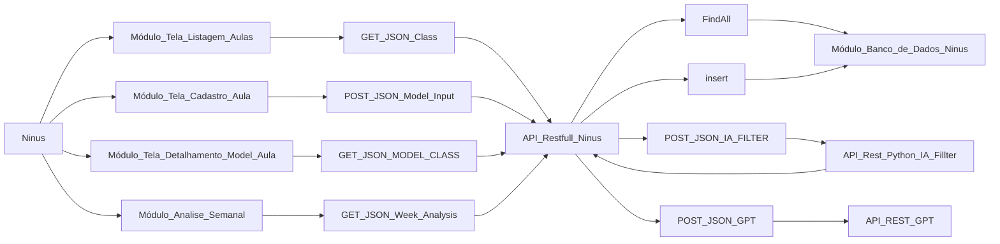

# Projeto Ninus 🐼📕
_A Ninus é uma solução oficial da **Smash Code!**_
> Smash Code! 

# Uma breve descrição 💬
_Nosso aplicativo se chama ninus e ele é para professores do ensino
infantil que desejam reduzir significamente o tempo de montagem de aula.
O foco do professor deve ser no ensinamento, e muitos professores do
Ensino infantil gastam entre 2 e 3 horas para montar uma aula, por
Justamente ser complexo e detalhado. Toda a montagem de aula deve
Seguir um padrão rígido da bncc (base nacional comum curricular), e isso
Faz a montagem de aula ficar ainda mais complexa e demorada_

_A ninus fornece uma ia que monta uma aula para um determinado eixo do
Ensino infantil, tudo o que o professor precisa fazer é fornecer algumas
Informações de input(entrada) para que a nossa ia gere um infográfico
Com a aula. A ia não esquecerá de considerar os alunos inclusos
(deficientes ou autistas etc.), o professor também poderá informar nos
Dados de input se há alunos inclusos dentro de sala de aula._

_O professor poderá criar aulas no aplicativo, marca-las como
Realizadas, e favorita-las. Cada aula terá um modelo (infográfico). Além
De fornecer um sistema de montagem, a ninus fornce um sistema de análise
De dados bem simples, para o professor acompanhar sua evolução. Após
Um professor marcar uma aula como realizada, o sistema pede um
Feedback e explica a importância do professor avaliar suas aulas. Com
Base nos feedbacks e na quantidade deles durante a semana, o sistema irá
Criar dashboards bem simples nada complexas, apenas para pontuar
Algumas coisas, ressaltar e mostrar algo. Essas análises serão
Semanais e caso o professor tenha avaliações o suficiente na semana,
Todo domingo de noite ele receberá uma notificação da ninus o informando
Que ele ganhou uma análise semanal. É apenas um adereço a mais no app,
Caso o professor não tenha avaliações o suficientes durante a semama,
Ele não ganhará uma análise semanal e nada mais mudará além disso._

_Como dito ali em cima, todo modelo de aula deve seguir a risca os padrões
Bncc, por isso é importante ressaltar que a ninus segue os padrões da
Bncc para o ensino infântil._

_Para ajudar a equipe de desenvolvimento criar o sistema de análise
Semanal, temos uma outra ia que servirá para gerar um resumo do dia,
Assim a ia de analise semanal não precisará analisar as aulas dos dias,
Apenas um resumo rico em informações relevantes do dia._

## Diagrama de Blocos do Sistema
_Um diagrama de blocos dos principais componentes do sistema, não são todos._

